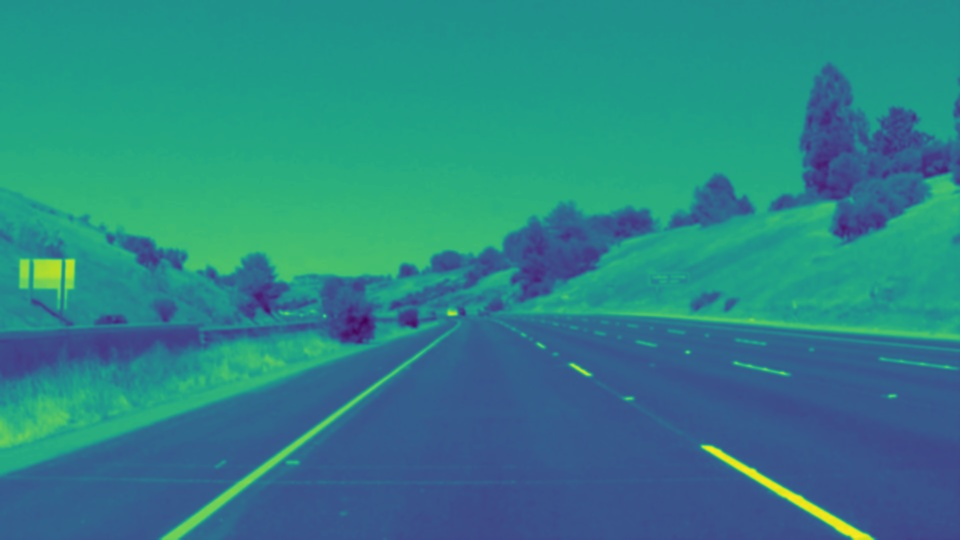
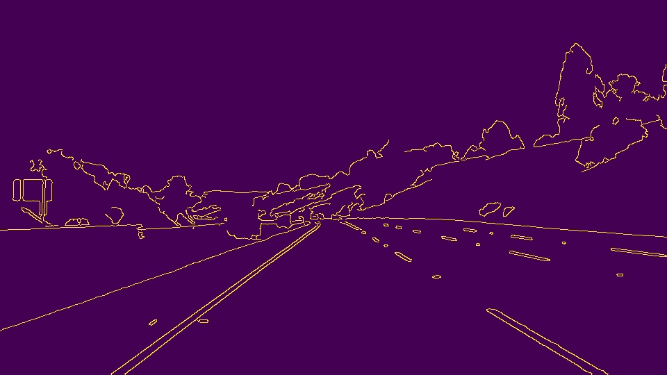
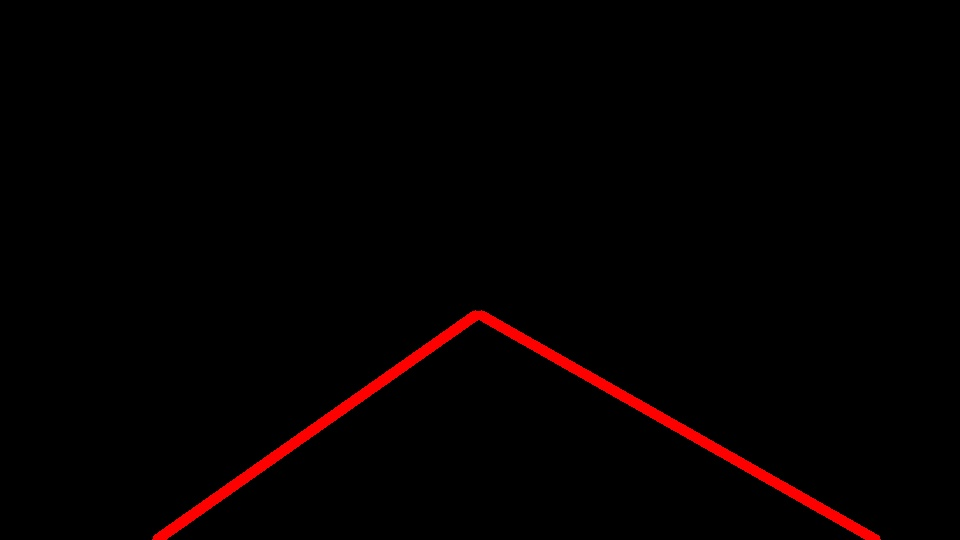
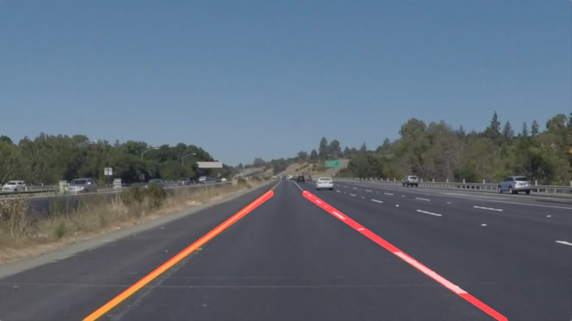
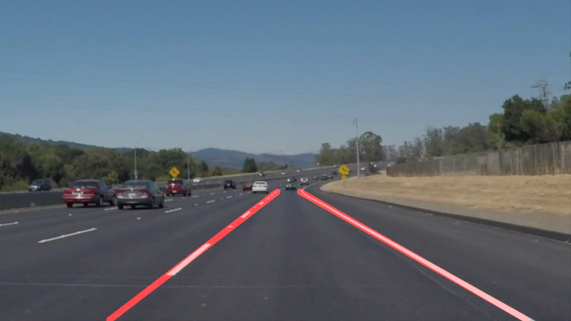
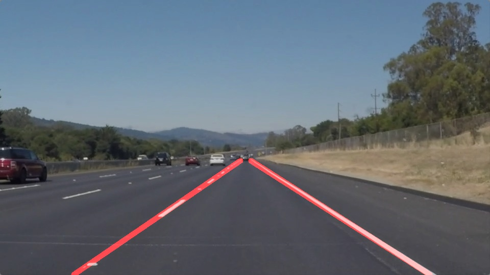
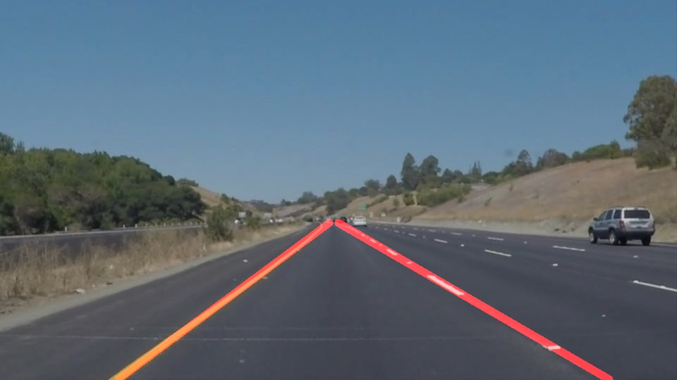
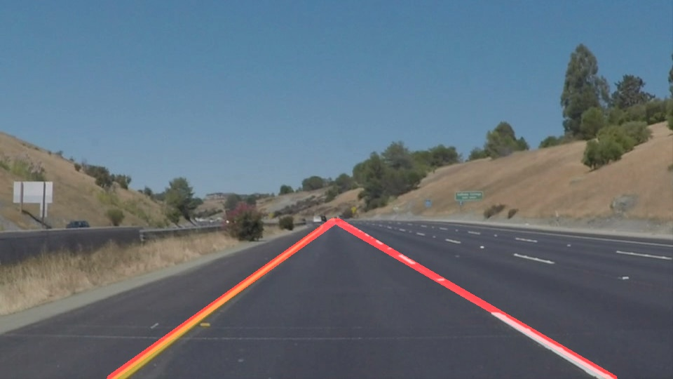
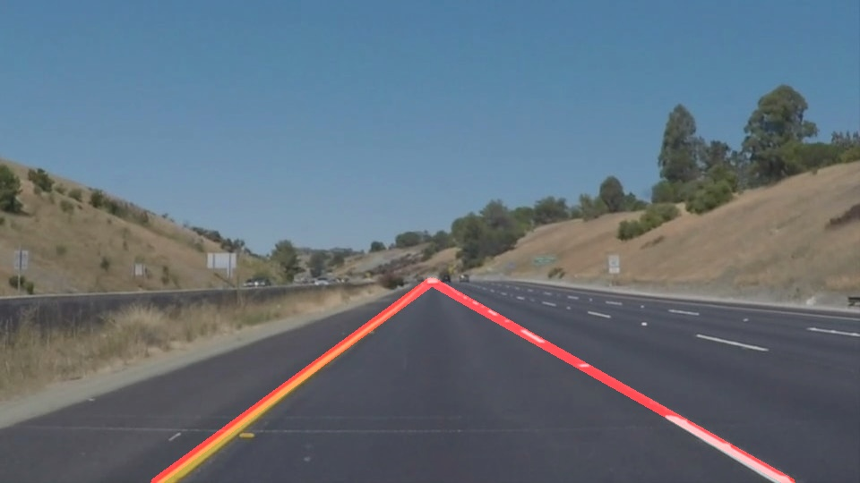

#**Finding Lane Lines on the Road**

## Goal
Selfdriving car needs to understand the environment to find out its next step. Camera is one of the sensors helps the car to find the portion of the road. Goal of the project is to find right and left lane in realtime to make car aware of its trajectory. Lane detection and marking involves several steps starting from getting single frame from video to final lane marking. This project provides pipeline to process single video frame.

## Pipeline
Image process pipeline takes an image applies series of filters in which output of one filter is used as input for other. Pipeline in this project outputs annotated lane image.

## Pipeline Components
There are six components used in this project.

* grayscale: It uses cvtColor of opencv to return single channel gray image. This take 3 channel image from video as input.

<figure>
 
 <figcaption>
 

 
 
Output of pipeline function grayscale
 
 </figcaption>
</figure>

* gaussian_blur: It blurs output image of grayscale by removing noise using cv2::GaussianBlur. Kernel size used for smoothing is 5.
<figure>
 
 <figcaption>
 

 
 
Output of pipeline function gaussian_blur
 
 </figcaption>
</figure>

* canny: Helps to get different forms of edges from the blured image using cv2.Canny.

<figure>
 
 <figcaption>
 

 
 
Output of pipeline function canny
 
 </figcaption>
</figure>

* Region of intereset: Selects the region on canny output. In the pipeline currently vertices of the region are partially hardcoded. 
* hough_lines: It uses canny transformation output and returns line drawn on a blank image of the input image size. Internally it findes all the lines in the region using cv2.HoughLinesP. Input lines are fed to another helper function draw_lines() that draws line. Left and right lines are determined by the slope of the line. Positive slope represents right line and -ve represents left line. A slope threshold is used to filter out unwanted lines. Average (x). (y) and slope is used to calculate intercept of the straight line. So that line can be extrapolated using y = slope * x + intercept. Since Y is known from slected region, find extrapolated co-ordinates x,x2 using x = y - intercept / slope for left and right lines. Draw extrapolated line.

<figure>
 
 <figcaption>
 

 
 
Output of pipeline function hough_lines
 
 </figcaption>
</figure>

* weighted_img: Use cv2.addWeighted to blend original and image with line drawn from the previous component.

<figure>
 
 <figcaption>
 

 
 
Final combined blended image
 
 </figcaption>
</figure>

## Results
### Output of test images from test_images
<figure>
 
 <figcaption>
 

 
 
solidWhiteCurve
 
 </figcaption>
</figure>
<figure>
 
 <figcaption>
 

 
 
solidWhiteRight
 
 </figcaption>
</figure>
<figure>
 
 <figcaption>
 

 
 
solidYellowCurve
 
 </figcaption>
</figure>
<figure>
 
 <figcaption>
 

 
 
solidYellowCurve2
 
 </figcaption>
</figure>
<figure>
 
 <figcaption>
 

 
 
solidYellowLeft
 
 </figcaption>
</figure>
<figure>
 
 <figcaption>
 

 
 
whiteCarLaneSwitch
 
 </figcaption>
</figure>

## Potential shortcomings with current pipeline
Pipeline woks fine with "test_videos/solidWhiteRight.mp4" and "test_videos/solidYellowLeft.mp4" but performs badly on "test_videos/challenge.mp4". Whenever there is curve or combination of shorter lines with significant slope differences cause average slope to deviate from most of the lines.

## Possible improvements
There is partial hardcoding in region selection. Slecting dynamic region will help to improve line detection when lane is curved. Also dividing lane into smaller more than one regions might help too. But it also might add performance penalty.
